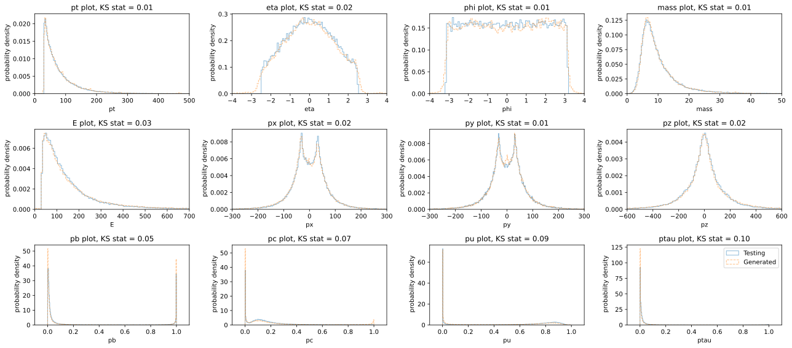
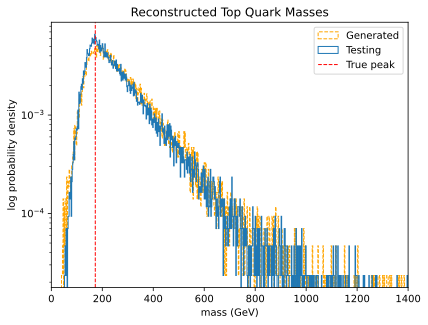
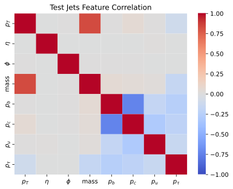
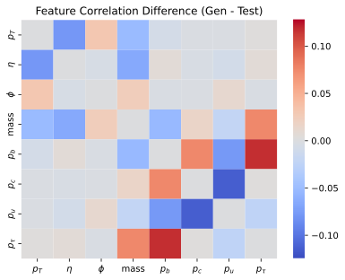

# Conditional normalizing flows for ATLAS jet simulation

This repository contains the code and diagnostic plots for my undergraduate physics thesis, **“Normalizing Flows for Detector-Level Jet Generation in Fully Hadronic $t\bar{t}$ Events.”**

The project studies whether a conditional normalizing flow can learn a fast, data-driven map from truth-level jet information to reconstructed ATLAS jet features. The central question is not only whether generated jets reproduce one-dimensional distributions, but whether they preserve correlations well enough to reconstruct event-level observables such as the top-quark mass.



## Project overview

The analysis uses the public [ATLAS $t\bar{t}$ JetSet dataset](https://opendata.cern.ch/record/atlas-93940), which contains simulated proton-proton collision events at $\sqrt{s}=13.6$ TeV.

The notebook:

1. converts jet momenta and masses from MeV to GeV;
2. applies the selections $p_T > 30$ GeV and $|\eta| < 2.5$;
3. retains events with exactly six selected reconstructed jets;
4. sorts jets within each event by decreasing $p_T$;
5. transforms the four GN2 flavour probabilities into three unconstrained log ratios,
   $z_b=\log(p_b/p_u)$, $z_c=\log(p_c/p_u)$, and $z_\tau=\log(p_\tau/p_u)$;
6. trains a conditional autoregressive rational-quadratic spline flow; and
7. evaluates generated events with feature histograms, correlation matrices, reconstructed $W$-boson masses, and reconstructed top-quark masses.

Each event is represented by a 42-dimensional reconstructed target vector (six jets times seven features) and a 24-dimensional truth-level context vector (six jets times four features).

## Model

The final notebook configuration uses:

| Component | Configuration |
| --- | --- |
| Base distribution | 42-dimensional diagonal Gaussian |
| Flow transforms | 12 autoregressive rational-quadratic spline blocks |
| Hidden network | 3 layers, 128 units per layer |
| Spline | 16 bins, tail bound 3 |
| Optimizer | Adam |
| Learning rate | $10^{-6}$ |
| Weight decay | $5\times10^{-5}$ |
| Batch size | 1024 |
| Training | 100 epochs |
| Reproducibility seed | 121 |

The model standardizes reconstructed targets using training-set statistics and conditions every spline transform on the truth-level event vector.

## Physics validation

Marginal agreement is necessary but not sufficient for a useful fast-simulation model. This project therefore evaluates three levels of fidelity:

- **Individual features:** reconstructed kinematics and GN2 flavour scores.
- **Correlations:** Pearson correlation matrices for generated and held-out jets.
- **Downstream observables:** reconstructed $W$-boson and top-quark masses.



The generated sample captures the main kinematic distributions and broad reconstructed top-mass shape. The most visible residual differences occur in flavour-score structure and some feature correlations. Across five independent trials reported in the thesis, the reconstructed top-mass comparison gave an average Kolmogorov-Smirnov statistic of $0.058\pm0.021$.

<table>
  <tr>
    <td></td>
    <td></td>
    <td></td>
  </tr>
  <tr>
    <td align="center">Held-out jets</td>
    <td align="center">Generated jets</td>
    <td align="center">Generated - held-out</td>
  </tr>
</table>

## Repository structure

```text
.
├── notebooks/
│   └── ThesisProject.ipynb    # authoritative, complete analysis
├── figures/                   # plots embedded in the notebook
├── requirements.txt
└── README.md
```

`ThesisProject.ipynb` is the authoritative implementation. Earlier exploratory notebooks are intentionally excluded.

## Reproducing the analysis

Create a Python environment and install the dependencies:

```bash
python -m venv .venv
source .venv/bin/activate
python -m pip install -r requirements.txt
```

Download the JetSet data from the [CERN Open Data Portal](https://opendata.cern.ch/record/atlas-93940). The notebook expects a jet-level parquet file named `jets.parquet` in its working directory. The original CERN release is HDF5, so prepare the parquet table with the columns used by the notebook before running the analysis.

Required reconstructed columns:

```text
eventNumber, pt, eta, phi, mass,
GN2v01_pb, GN2v01_pc, GN2v01_pu, GN2v01_ptau
```

Required truth-matched columns:

```text
ptFromTruthJet, etaFromTruthJet, phiFromTruthJet, mFromTruthJet
```

Then start Jupyter:

```bash
jupyter lab
```

Open `notebooks/ThesisProject.ipynb`. If the data file is outside the notebook directory, update the `jets.parquet` path in the data-loading cells.

Training the full configuration is computationally intensive; the reference run used a CUDA-capable GPU.

## Limitations and next steps

The fixed six-jet representation imposes an ordering and excludes variable-multiplicity events. A natural next step is a permutation-invariant set, graph, or transformer representation. Track- and vertex-level generation could also improve flavour-tagging fidelity by predicting lower-level detector information before applying a dedicated tagger, instead of directly learning highly peaked output scores.

## References

- ATLAS Collaboration, [ATLAS $t\bar{t}$ simulation for ML-based jet flavour tagging (JetSet)](https://opendata.cern.ch/record/atlas-93940), CERN Open Data Portal, 2025. DOI: [10.7483/OPENDATA.ATLAS.QG8W.TO8P](https://doi.org/10.7483/OPENDATA.ATLAS.QG8W.TO8P).
- ATLAS Collaboration, [“Transforming jet flavour tagging at ATLAS”](https://doi.org/10.1038/s41467-025-65059-6), *Nature Communications* 17, 541 (2026).
- C. Durkan, A. Bekasov, I. Murray, and G. Papamakarios, [“Neural Spline Flows”](https://arxiv.org/abs/1906.04032), NeurIPS 2019.
- V. Stimper et al., [“normflows: A PyTorch Package for Normalizing Flows”](https://doi.org/10.21105/joss.05361), *Journal of Open Source Software* 8, 5361 (2023).

## Author

Jiaxun Lu  
Advisor: Prof. Gordon Watts

